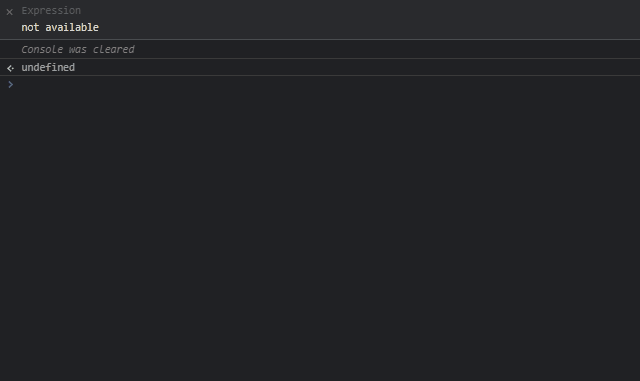

# loggerine
🖋 A simple, reliable and easy to use logger

> Warning! Loggerine is on an early stage, it may have some bugs

## Features
- 📦 Lightweight. Just 2Kb bundled
- 🧂 Simple. The package is just a single class with a few functions
- 🔌 Fast. It's simple, it's fast
- 📚 Documented. It's simple, it's almost self-documenting, although there are docs
- 🗽 Open Source. MIT License, as simple as the library

## Getting started
Install the library with
```
npm install @techiepi/loggerine
```
You're done! Now you can use the library like in the example below
```js
const logger = new Loggerine({
    module: "Example",
    debugLevel: 3,
    useVanillaFunctions: true
});

logger.debug("This is a test debug"); // Shouldn't do anything because the debug level is < 4
logger.info("This is a test info"); // Should print it because the debug level is >= 3
logger.warn("This is a test warn"); // Should print it because the debug level is >= 3
logger.error("This is a test error"); // Should print it because the debug level is >= 3
```


## Build
You can run
```
npm run build
```
to build the library

## License
This project is licensed under the [MIT license](LICENSE)
